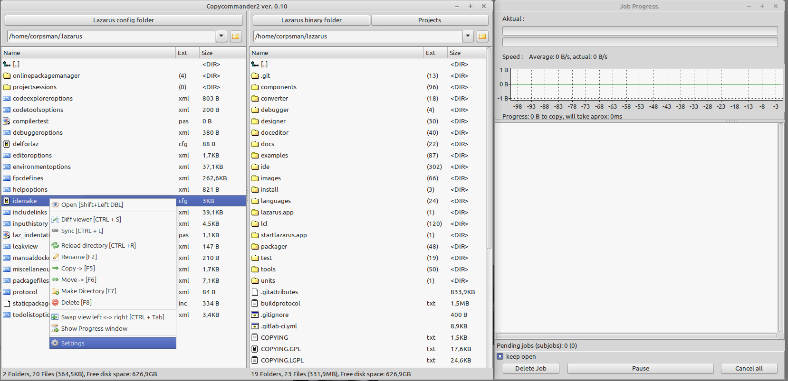

CopyCommander is a tool for windows/linux to use queued file-copy/moves from one to another directory. It also allows synchronizing of files over two directories.

A manual can be found [here](src/how_to_use.txt)

If you do not have Lazarus you can directly download a precompiled binary [from](https://www.corpsman.de/klickcounter.php?url=download/copycommander.zip).

