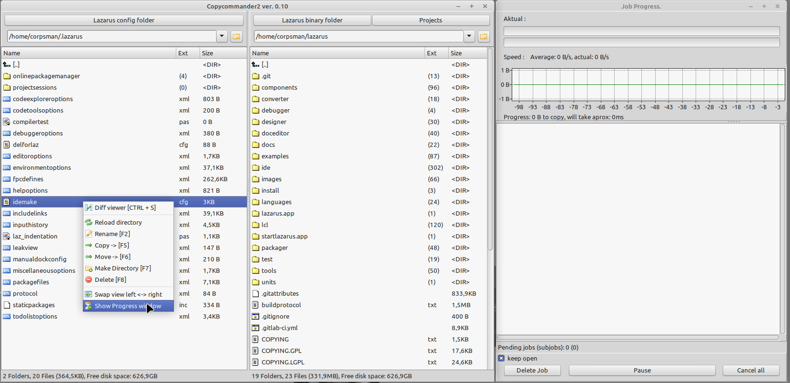

CopyCommander is a tool for windows/linux to use queued file-copy/moves from one to another directory. It also allows two different synchronizings of files over two directories (diff viewer, sync).

A manual can be found [here](src/how_to_use.md).

## What needs to be done to compile CopyCommander2

To be able to compile the code you need the [Lazarus-IDE](https://www.lazarus-ide.org)

Inside Lazarus you need to install the following packages:
- L-Net from [almindor](https://github.com/almindor/lnet) or [PascalCorpsman](https://github.com/PascalCorpsman/lnet) use the online Packagemanager to install (recomended to use the PascalCorpsman version)

## Direct download link (not always the newest version)

If you do not have Lazarus you can directly download a precompiled binary [from](https://www.corpsman.de/klickcounter.php?url=download/copycommander.zip).

