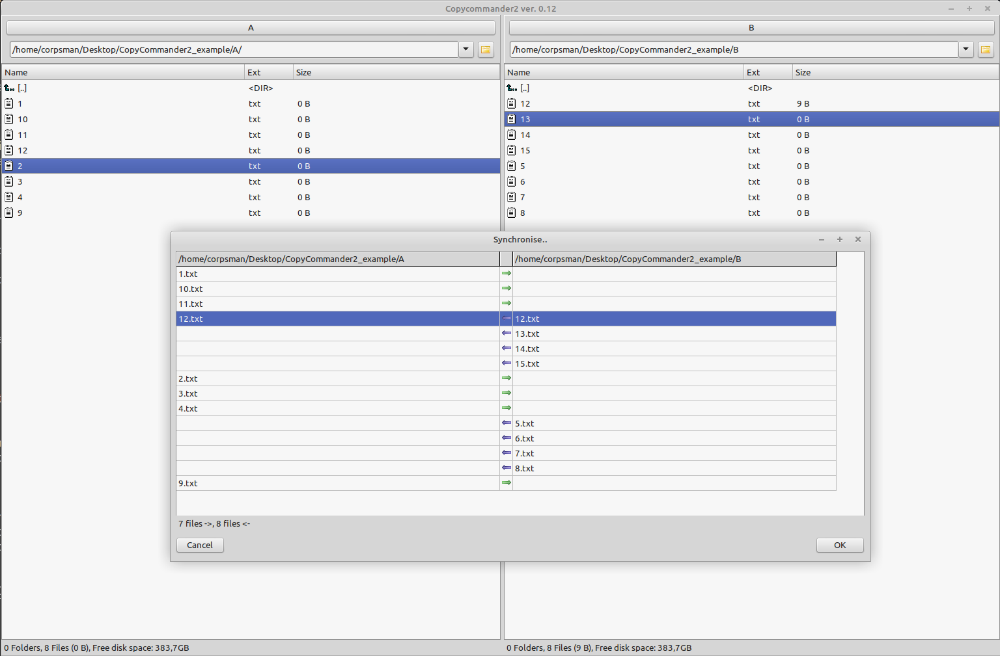

# Manual for CopyCommander2

## Usage

This Programm is orientated on the "Total Commander" application for Windows.

The main porpuse of this programm is copying and moveing files / directories, in a queue.

### "open"

If set in the settings, this can call a external programm with the actual selected file.

### "diff viewer" folder feature

Navigate to two different folders that you want to be synchronized. Press CTRL + S to open the diff viewer folder dialog.

In the upcomming dialog you can see the suggestions by the programm for the copy jobs to make both folders "same".

By right click in the Synchronize Dialog you can change the copy direction of files, or 
 disable copying directories (also available the key commands "N", "L", "R")

### "sync" folder feature

When you want to sync a "source" folder to a "target" folder (e.g. update a backup). Press CTRL + L to open the sync folder dialog.

except "delete empty folders" all "work" that will be done is exportable as .csv (see backround)

### Main Screen

Select some files, or folders with the mouse or keyboard and press

F5 to copy the selected ones to the destination on the other side

F6 to move the selected ones to the destination on the other side

additional you can press

F7 to prompt the create subfolder dialog

F8 to delete a file or directoy

CTRL + R to reload the actual folder view

Drag and Drop exact one file from outside the programm into one of the listviews, will change the 
folderview to the desination of this file.

Drag and Drop more then one file from outside into one of the listviews, will put them on
the copy list, to copy them to the folder shown in the listview.

### The in app shortcutbuttons

If you want to use predefined loaddirectories enter the path into one of the edit fields and right 
click on that field to open the popup menu, than click "Add". If you want to delete one of the 
shortcut buttons right click on the button and choose delete.

## REST API

CopyCommander2 has support for the REST-API, with this support you can utilize CopyCommander2 from other applications to execute jobs and even control the application (zombiemode) via REST API.

| Command | Description |
| --- | --- |
| -enablerest | only if set, rest is enabled
| -restport=\<port> | sets the port of the rest server to \<port> (default is 8080)
| -restzombiemode | if set, the "zombie" commands are also enabled 

To see all supported commands see the [REST](rest.md) documentation

## License
see [here](https://github.com/PascalCorpsman/CopyCommander2/blob/main/license.md)

## Warranty
There is no warranty !
